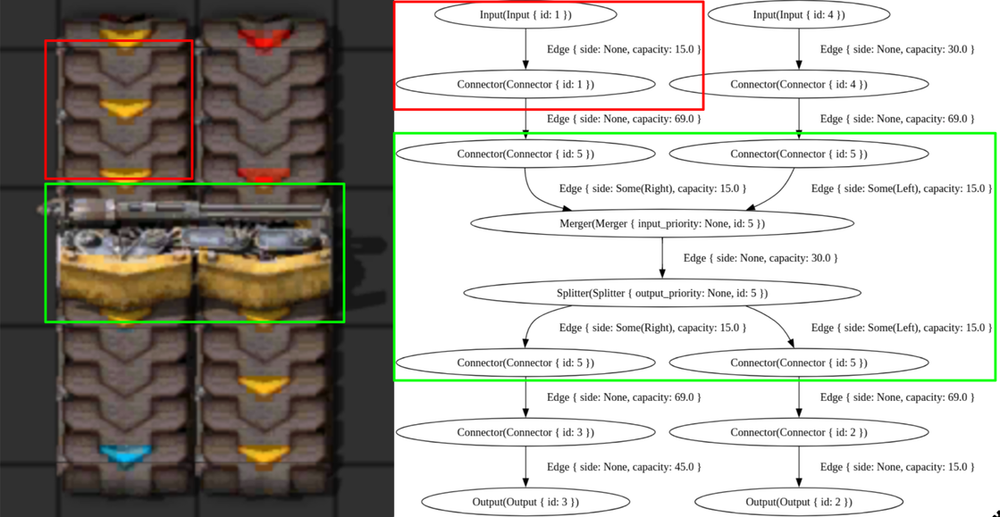

# Design Document

## High level overview

## From Blueprint string to Entities

## From Entities to IR

### Intermediate Representation(IR) Description

The IR used is a graph-based IR.
Each `Node` can be of one of the following:

| Node type | In degree | Out degree | Description | Notes |
|-----------|-----------|------------|-------------|-------|
| Input | 0 | 1 | Represents an entity serving as an input e.g. a belt. | - |
| Output | 1 | 0 | Represents an entity serving as an output e.g. a belt. | - |
| Connector | 1 | 1 | Represents an entity connecting two other entities e.g. an inserter. | - |
| Splitter | 1 | 2 | Represents an entity splitting the input into two outputs e.g. a splitter. | Can have left, right or no priority. |
| Merger | 2 | 1 | Represents an entity merging two inputs into the output e.g. a splitter. | Can have left, right or no priority. |

Each `Node` has a field `id` mapping it to the entity from which it was generated.

The nodes in the graph are connected via `Edge` objects.\
These have an optional `side` field used in conjunction with the priority of splitters/mergers and a maximum `capacity`.\
The `capacity` field represent the maximum throughput of that edge in terms of items/s.

#### Example

### Conversion

The conversion depends on whether or not we consider the belts as having only one lane or being split into two lanes like in the game.
When considering the first case it is quite straightforward how to construct the graph:
 - Belts are turned into two connectors connected by an edge with the capacity of the belt.
 - Undergrounds are modelled analogously to the regular belts.
 - Splitters are modelled as a merger connected to a splitter, with the edge having a capacity of double the splitters capacity.
   Additionally we add two connectors to both the merger and splitter end having the same capacity as the splitter.
 - Connectors are replaced with either an input or an output node depending on whether it has in_deg = 0 or out_deg = 0.

### Shrinking algorithm
Converting a blueprint to graph as described above results in a graph that correctly models the given Factorio blueprint but is still very redundant in it's representation.
E.g. a long line of belts connected together would result in a lot of connectors connected in series or a splitter that only takes one input doesn't need a merger in the IR.
Therefore we need an algorithm that still preserve the correctness of the model and also minimizes the size and complexity of the resulting graph.

## From IR to z3 model